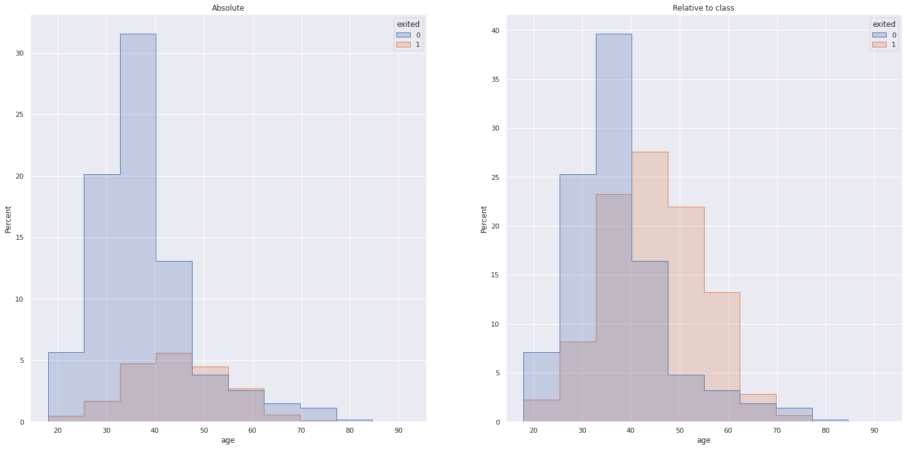
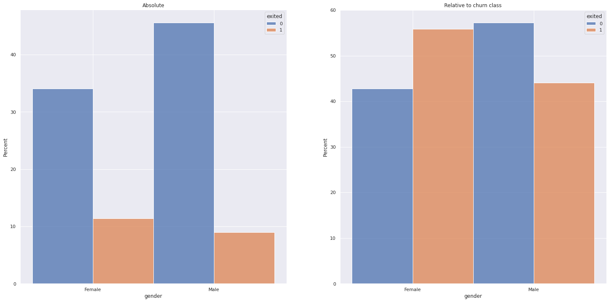
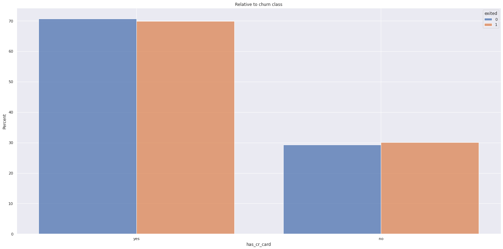

# Customer Churn Prediction

## Customer Churn Prediction for a Bank.

A Data Science Project on a Churn Dataset.

If you wish, you may interact with the final solutions data products I built:

#### This project was made by Humberto Aguiar.

# 1. Business Problem.

A Bank is experimenting an increase in numbers of customer churn and needs a way to reduce these numbers.

# 2. Business Assumptions.
- Customer Churn can be predicted.
- Customer Churn can be prevented with incentives such as coupons/gift cards.
- Customer Churn is affected by factors present in the dataset.

# 3. Solution Strategy
- Explore data to:
    - Answer business questions.
    - Generate nsights.

My strategy to solve this challenge was:
- Create an ML classification model to predict customers that are more likely to churn.
- Offer these customers discount coupons.

**Step 01. Data Description:** Analyze Data briefly and its statistics to have a basic idea of the granularity and general info of the data.

**Step 02. Feature Engineering:** If possible derive new features from the dataset. There are not many features available so I don't expect new features to be derived.

**Step 03. Data Filtering:** If there are some Irregularities, remove them.

**Step 04. Exploratory Data Analysis:** Explore the data concerning frequency, do a bivariate analysis with respect to the response variable, analyze some business hypotheses to generate insights.

**Step 05. Data Preparation:** Apply methods to balance the dataset such as oversampling, downsampling, and SMOTE.

**Step 06. Feature Selection:** Select the most important features or all of them since we don't have many available.

**Step 07. Machine Learning Modelling:** Test different models and select the best in terms of performance and resource usage.

**Step 08. Hyperparameter Fine Tuning:**  Apply tunning to the parameters.

**Step 09. Convert Model Performance to Business Values:** Calculate the revenue the model could generate if put into production.

**Step 10. Deploy Modelo to Production:** Deploy the model on a free cloud server building an API.

# 4. Top 3 Data Insights

**Younger customers churn more (H4)**
**False**: The highest percentages of churn are observed in customers above 40 years old.

**Gender matters in customer churn (H8)**
**True**: Female customers respond to 55% of the churns observed
We could create a marketing program focused on women since they are more likely to churn.

**Customers who have a credit card churn less (H9)**
**False**: Churn rates are identical whether or not a customer possesses a credit card
This insight can be useful when prioritizing prone-to-churn customers since those that use a credit card possibly generate more revenue.

# 5. Machine Learning Model Applied
Before applying any ML models I tested several oversampling, downsampling, and a combination of both procedures using a KNN Classifier and measured ROC AUC to select the best method to increase the final ML performance.

Unfortunately, most methods didn't increase performance significantly when compared to no sampling procedure at all, therefore I chose the best one since it both increased performance and reduced variance its variance.

I also tested the following models and selected LGBMClassifier since it presented one of the best ROC AUC scores, as well as a good combination between recall and precision.

|Model|roc_auc|recall|precision|accuracy|
|:-:|:-:|:-:|:-:|:-:|
|  BalancedRandomForestClassifier|0.788463|0.733129|0.382574|0.704187|
|                  LGBMClassifier|0.787750|0.589264|0.475864|0.783813|
|              CatBoostClassifier|0.796408|0.589264|0.495066|0.793687|
|          RandomForestClassifier|0.787034|0.573926|0.486675|0.789562|
|                 XGBRFClassifier|0.792957|0.549387|0.505210|0.797625|
|              LogisticRegression|0.758591|0.475153|0.465466|0.781813|
|                             SVC|0.761041|0.461350|0.475455|0.786500|

# 6. Machine Learning Model Performance

For the selected threshold the performance of the model is the following:

ROC AUC Score= 0.7187

|Class|Precision|Recall|F1-score|Support|
|:-:|:-:|:-:|:-:|:-:|
|Not Churn|0.91|0.69|0.79|1593|
| Churn |0.38|0.75|0.50| 407|
|Accuracy| ||0.70|2000|

Therefore the model was able to correctly predict 75% of churns, even though this was obtained by reducing the threshold below 50%, which decreased both precision and accuracy, the result is satisfactory given that misclassifying a customer as not churn and losing the customer by not taking action, is worse than misclassifying a customer as churn and giving them a gift card.

We can see that by prioritizing, for example, the 20% customers that the model gave the highest prediction of churning is more than 2.5x more effective than randomly trying to find the churning customers.

# 7. Business Results

I simulated 3 possible scenarios given a budget of $50,000.00 and the most realistic one has a return on investment of 4823% and could avoid 46% of the churns. 

|Scenario| Return| ROI| Churns avoided|Churns avoided %|Churns unavoided|False Churns Awarded|False Churn Expenses|
|:-:|:-:|:-:|:-:|:-:|:-:|:-:|:-:|
|Best| $2,997,077.45 |  5994.15%|   240 |    58.97%| 167| 254|    $13,680.00|
|Realistic |$2,411,766.39|  4823.53%|   187 |    45.95%| 220| 131|    $17,450.00|
|Worst |$1,421,669.76|  2843.34%|   114|    28.01%| 293| 37| $11,450.00|

# 8. Conclusions
Finishing this first iteration in the CRISP cycle I built and deployed two applications to help others use my work:

- A Flask API to receive POST requests with data from a customer and return a prediction of their probability of churn.
- A Streamlit web app that allows the user to interact with the API and predict the probability of churn for any given customer on the database (test dataset), filter customers based on their attributes to make predictions, and sort the results by any attribute.

Feel free to interact with the Web App I developed:

# 9. Lessons Learned
- Oversampling and downsampling methods won't always do wonders to performance as they may seem to do in some references.
- Several metrics must be taken into account to evaluate models' real predictive power.
- It can be time-saving to test several different models since some of them might offer great performance in computing time, just like in this case, LightGBM Classifier was very superior to other models in this respect.

# 10. Next Steps to Improve
- Implement a Knapsack algorithm to optimize financial returns by selecting customers that have both Lifetime values and churning probability, not just the latter.
- If possible, gather more data to increase the performance of the predictive models.

# Author Humberto

If I can be of assistance, or you have any suggestions please do not hesitate to contact me:

